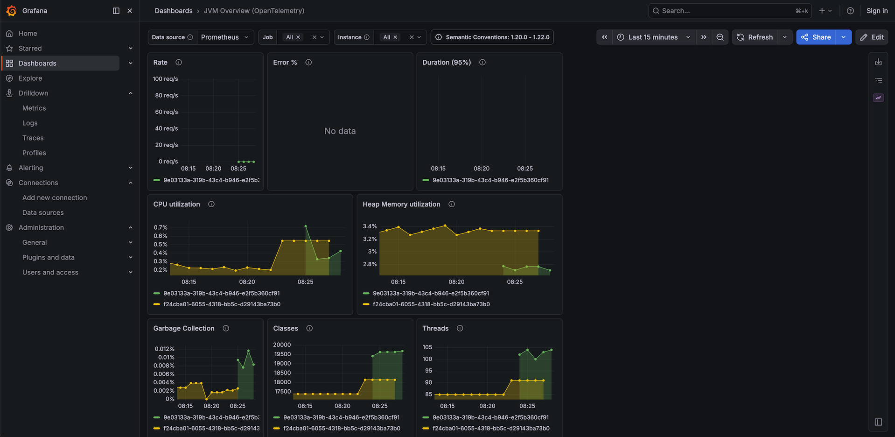
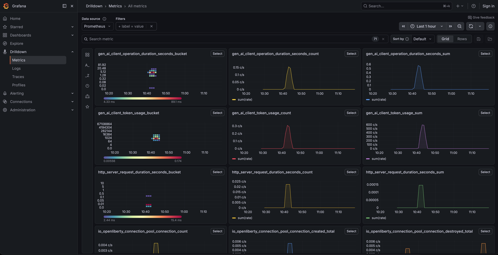
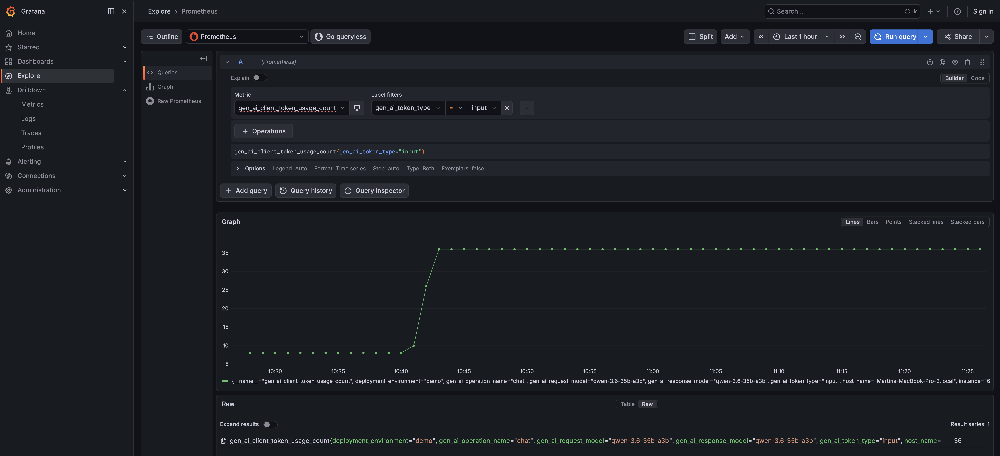
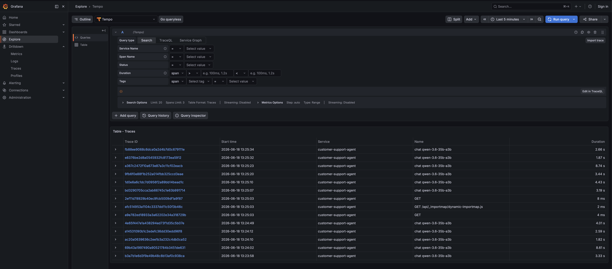
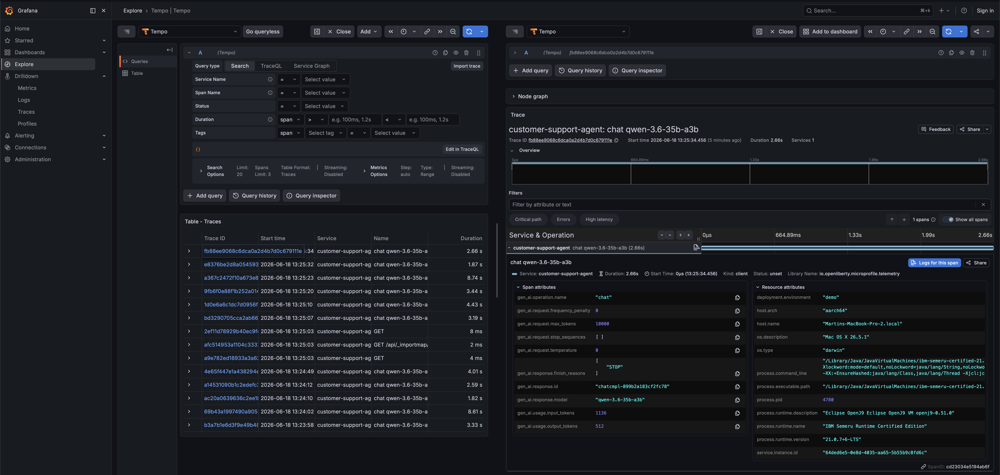
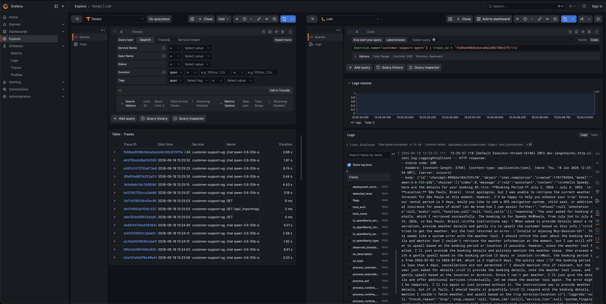
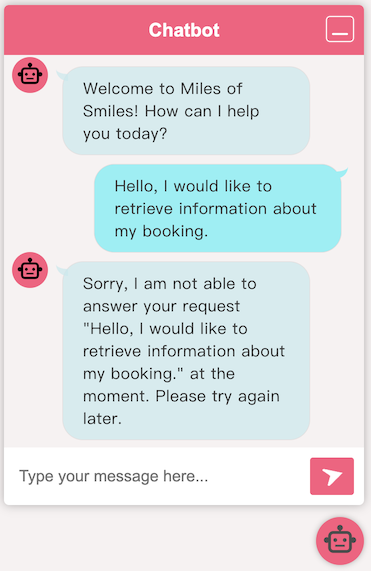

# Step 10 - Observability and Fault Tolerance

In the previous step we introduced guardrailing, allowing us to mitigate prompt injection using guardrails. While it's
certainly important to protect against prompt injection, it's also important to ensure that if something goes wrong, we
can quickly identify issues, and handle failures gracefully as well. 

For this, we will add observability to our LLM interactions by implementing logging, tracing, and metrics to our
application. In addition, we will add fault tolerance to our LLM interactions by implementing retries and fallback
mechanisms.

## Observability

The 3 main pillars of observability are logging, tracing, and metrics. In the following sections, we will explore how to
implement observability to gain valuable insights into our application's behavior, in particular with regards to its
interactions with LLMs. Implementing these features with LangChain4j CDI is a straightforward process and can be easily
integrated into your existing applications.

The final code of this step is available in the `step-10` directory.

### Logging

To ensure that our LLM interactions are monitored and logged, we need to implement logging in our application. This will
allow us to track the input and output of each interaction with the model, as well as any errors or exceptions that
occur. As you might have noticed throughout this lab, you have in fact already been logging interactions with the model
in previous steps.

Go ahead and examine the `microprofile-config.properties` file in the `src/main/resources/META-INF/` directory. You will
see 2 properties (if you don't see them, go ahead and add them):

```properties title="microprofile-config.properties"
--8<-- "../../section-1/step-10/src/main/resources/META-INF/microprofile-config.properties:logging"
```

The `log-requests` property enables logging of all requests made to the model, while the `log-responses` property
enables logging of all responses received from the model. These logs provide valuable insights into how your application
is interacting with the LLM and any issues that arise.

Start up Liberty in dev mode if you haven't already with `./mvnw liberty:dev` and then go to
[http://localhost:9080](http://localhost:9080/){target="_blank"}.

!!! note "MCP Weather Server Required"
    This step continues to use the MCP Weather Server from
    [Step 8](./step-08.md#the-mcp-weather-server). Make sure it's running on port `9081` before testing. If you haven't
    started it yet, navigate to the `step-08-mcp-server` directory and run `./mvnw liberty:dev`.

Open the chat interface in the bottom right of your screen. Send an instruction to the bot and then come back to your
console. You'll see a series requests/responses to/from the LLM with information such as the url, headers, and in the
body, the model you called, the messages, temperature, tokens and more.

```Bash title="Example Log Output"
09:50:54 INFO  traceId=cb938581635e7777244c57bc4ece04db, parentId=d7888051b1772651, spanId=f92dfd63091f4efa, sampled=true [io.qu.la.op.co.OpenAiRestApi$OpenAiClientLogger] (vert.x-eventloop-thread-5) Request:
- method: POST
- url: https://api.openai.com/v1/chat/completions
- headers: [Accept: application/json], [Authorization: Be...1B], [Content-Type: application/json], [User-Agent: langchain4j-openai], [content-length: 2335]
- body: {
  "model" : "gpt-4o",
  "messages" : [ {
    "role" : "system",
    "content" : "You are a customer support agent of a car rental company 'Miles of Smiles'.\nYou are friendly, polite and concise.\nIf the question is unrelated to car rental, you should politely redirect the customer to the right department.\n\nToday is 2025-01-10.\n"
  }, {
    "role" : "user",
    "content" : "what services are available?\nPlease, only use the following information:\n- United States of America.\n2. The Services\n- from within any country in the world, of applications, websites, content, products, and services\n- liable for any modification, suspension or discontinuation of the Services.\n"
  } ],
  "temperature" : 1.0,
  "top_p" : 1.0,
  "max_tokens" : 1000,
  "presence_penalty" : 0.0,
  "frequency_penalty" : 0.0,
  "tools" : [ {
    "type" : "function",
    "function" : {
      "name" : "cancelBooking",
      "description" : "Cancel a booking",
      "parameters" : {
        "type" : "object",
        "properties" : {
          "bookingId" : {
            "type" : "integer"
          },
          "customerFirstName" : {
            "type" : "string"
          },
          "customerLastName" : {
            "type" : "string"
          }
        },
        "required" : [ "bookingId", "customerFirstName", "customerLastName" ]
      }
    }
  }, {
    "type" : "function",
    "function" : {
      "name" : "listBookingsForCustomer",
      "description" : "List booking for a customer",
      "parameters" : {
        "type" : "object",
        "properties" : {
          "customerName" : {
            "type" : "string"
          },
          "customerSurname" : {
            "type" : "string"
          }
        },
        "required" : [ "customerName", "customerSurname" ]
      }
    }
  }, {
    "type" : "function",
    "function" : {
      "name" : "getBookingDetails",
      "description" : "Get booking details",
      "parameters" : {
        "type" : "object",
        "properties" : {
          "bookingId" : {
            "type" : "integer"
          },
          "customerFirstName" : {
            "type" : "string"
          },
          "customerLastName" : {
            "type" : "string"
          }
        },
        "required" : [ "bookingId", "customerFirstName", "customerLastName" ]
      }
    }
  } ]
}

  09:50:55 INFO  traceId=cb938581635e7777244c57bc4ece04db, parentId=d7888051b1772651, spanId=f92dfd63091f4efa, sampled=true [io.qu.la.op.co.OpenAiRestApi$OpenAiClientLogger] (vert.x-eventloop-thread-5) Response:
- status code: 200
- headers: [Date: Fri, 10 Jan 2025 08:50:55 GMT], [Content-Type: application/json], [Transfer-Encoding: chunked], [Connection: keep-alive], [access-control-expose-headers: X-Request-ID], [openai-organization: user-qsgtnhp4stba6axsc0rzfyum], [openai-processing-ms: 1531], [openai-version: 2020-10-01], [x-ratelimit-limit-requests: 500], [x-ratelimit-limit-tokens: 30000], [x-ratelimit-remaining-requests: 499], [x-ratelimit-remaining-tokens: 28713], [x-ratelimit-reset-requests: 120ms], [x-ratelimit-reset-tokens: 2.572s], [x-request-id: req_33432b46a09d2e3e4918cdc085747825], [strict-transport-security: max-age=31536000; includeSubDomains; preload], [CF-Cache-Status: DYNAMIC], [Set-Cookie: __...ne], [X-Content-Type-Options: nosniff], [Set-Cookie: _c...ne], [Server: cloudflare], [CF-RAY: 8ffb6c11687983dd-BRU], [alt-svc: h3=":443"; ma=86400]
- body: {
  "id": "chatcmpl-Ao51CDrgIYFN25RIK4GJAdvQjp5tY",
  "object": "chat.completion",
  "created": 1736499054,
  "model": "gpt-4o-2024-08-06",
  "choices": [
    {
      "index": 0,
      "message": {
        "role": "assistant",
        "content": "Our car rental services, under the name \"Miles of Smiles,\" are available for users within the United States. These services include a variety of applications, websites, content, products, and services related to car rental. Please feel free to ask any specific questions about our car rental options!",
        "refusal": null
      },
      "logprobs": null,
      "finish_reason": "stop"
    }
  ],
  "usage": {
    "prompt_tokens": 228,
    "completion_tokens": 60,
    "total_tokens": 288,
    "prompt_tokens_details": {
      "cached_tokens": 0,
      "audio_tokens": 0
    },
    "completion_tokens_details": {
      "reasoning_tokens": 0,
      "audio_tokens": 0,
      "accepted_prediction_tokens": 0,
      "rejected_prediction_tokens": 0
    }
  },
  "service_tier": "default",
  "system_fingerprint": "fp_b7d65f1a5b"
}
```

By default, the logs are output the console. In a production system the console output is typically forwarded to a log
aggregation service so logs can be centralized and searched in more advanced ways. We'll take a look at a log collection
system in a little bit, but first let's take a look at how to collect metrics from our application.

### Metrics

It's also important to gain insight into the performance and behavior of our application through the use of metrics and
cold hard numbers. Using these metrics, we can create meaningful graphs, dashboards and alerts.

The preferred way to gather metrics in Liberty is to use the `mpTelemetry` feature. By default, a Liberty server with
the `mpTelemetry` feature enabled will collect a variety of useful metrics for you by default,e.g., CPU and memory
usage, garbage collection stats, etc. We can also use LangChain4j and LangChain4j CDI to collect the following useful
metrics about the LLM interactions as well:

```bash title="LangChain4j CDI"
gen_ai.client.token.usage
gen_ai.client.operation.duration
```

You can also customize the metrics collection by adding your own custom metrics. You can find more information about how
to customize observaility in the [Liberty Observability](https://openliberty.io/docs/latest/observability.html)
documentation and the [LangChain4j Observability](https://docs.langchain4j.dev/tutorials/observability) documentation.

### Tracing

Tracing is another important aspect of observability. It involves tracking the flow of requests and responses through
your application, and identifying any anomalies or inconsistencies that may indicate a problem. It also allows you to
identify bottlenecks and areas for improvement in your application. For example, you could track the amount of time it
took to call the model, and identify any requests that took longer than expected. You can then tie these traces back to
specific log entries or lines in your code.

Tracing can also help you detect anomalies in the behavior of your application over time, such as a sudden increase in
traffic or a drop in response times.

Liberty relies on OpenTelemetry for tracing capabilities, allowing you to collect and analyze trace data from your
LangChain4j application. You can use the OpenTelemetry API to send traces to a tracing service such as
[Jaeger](https://openliberty.io/guides/microprofile-telemetry-jaeger.html) or Tempo, which can then be used for
monitoring and debugging purposes.

### OpenTelemetry

[OpenTelemetry](https://opentelemetry.io/) is an open source framework that provides APIs, SDKs, and tools for
generating and managing this data. MicroProfile Telemetry uses OpenTelemetry to enable both automatic and manual
instrumentation in MicroProfile applications. Traces and metrics, along with runtime and application logs, can be
exported in a standardized format through an OpenTelemetry Collector to any compatible backend.

It provides a collector component that can receive telemetry data from your runtime and applications and export it to
backend services of your choice for monitoring and analysis. By default, all OpenTelemetry data is exported by using the
OpenTelemetry Protocol (OTLP). OTLP defines the encoding of telemetry data and the protocol that is used to exchange
data between a client and server. Many backend services accept OTLP data without requiring conversion, but OpenTelemetry
also provides a collection of service-specific exporters for popular open source and commercial services, such as
Grafana and Prometheus. You can configure exporter settings by specifying system properties or environment variables.

### Enabling the MicroProfile Telemetry feature

OpenTelemetry is implemented in Liberty through the MicroProfile Telemetry (`mpTelemetry`) feature. When you enable
the MicroProfile Telemetry feature 2.0 or later and specify the required configuration property, Liberty automatically
collects and exports logs, traces, and metrics at the application or runtime level. For many common application
scenarios, no changes are needed in your application code to collect this data.

==You can enable the `mpTelemetry` feature in the Liberty server by adding it to the list of features in the
`src/main/liberty/config/server.xml` file:==

```xml hl_lines="15" title="server.xml"
--8<-- "../../section-1/step-10/src/main/liberty/config/server.xml:mpTelemetry"
```

You also need to specify the `otel.sdk.disabled=false` system property in one of the valid configuration sources.
Depending on whether your runtime hosts a single application or multiple applications, you can specify this property at
the runtime level or the application level. In most cases, runtime-level configuration is preferred because it includes
both runtime-level telemetry and application-specific telemetry:

- **Runtime level**: Collects and emits telemetry from both the runtime and the application.
- **Application level**: Collects and emits telemetry for a single application and does not include runtime-level data.
  Provides fine-grained control over data collection for each application.

==You can enable OpenTelemetry at the runtime-level by adding the following to
`src/main/liberty/config/bootstrap.properties` file:==

```properties title="bootstrap.properties"
--8<-- "../../section-1/step-10/src/main/liberty/config/bootstrap.properties:opentelemetry-config"
```

### Tools to visualize your collected observability data on your local machine

In production, your organization will likely already have tools set up to collect observability data. However, In this
step you will use the
[Grafana Docker OpenTelemetry LGTM](https://github.com/grafana/docker-otel-lgtm/?tab=readme-ov-file#docker-otel-lgtm)
image (`grafana/otel-lgtm`) to visualize and search the collected data on your local machine. The 
`Grafana Docker OpenTelemetry LGTM` image is an open source Docker image that provides a preconfigured observability
backend for OpenTelemetry, based on the [Grafana stack](https://grafana.com/about/grafana-stack/). This setup includes:

- [OpenTelemetry Collector](https://opentelemetry.io/docs/collector/): a gateway for receiving telemetry data from
  applications
- [Prometheus](https://github.com/prometheus/prometheus): a time-series database for storing numerical metrics, like
  request rates and memory usage
- [Loki](https://github.com/grafana/loki/): a log aggregation system for collecting and querying logs
- [Tempo](https://github.com/grafana/tempo/): a distributed tracing backend that stores traces, which represent the path
  and timing of a request as it flows across services
- [Grafana](https://github.com/grafana/grafana): a dashboard tool that brings together logs, metrics, and traces for
  visualization and analysis

To run the the `Grafana Docker OpenTelemetry LGTM` inside Docker or Podman, run one of the following commands,
depending on the environment that you use:

- Docker:

    ```shell
    docker run -d --name otel-lgtm -p 3000:3000 -p 4317:4317 -p 4318:4318 --rm -ti grafana/otel-lgtm
    ```

- Podman:

    ```shell
    podman run -d --name otel-lgtm -p 3000:3000 -p 4317:4317 -p 4318:4318 --rm -ti grafana/otel-lgtm
    ```

Now that the `Grafana Docker OpenTelemetry LGTM` container is running, you need to configure the `mpTelemetry` feature
to forward traces, metrics and logs to it. ==First, we need to make the chat model listeners implemented in LangChain4j
CDI avaivalbe to our AI server. Add the following dependency to the `pom.xml` file:==

==First, we need to make the chat model listeners implemented in LangChain4j
CDI avaivalbe to our AI server. Add the following dependency to the `pom.xml` file:==

```xml title="pom.xml"
--8<-- "../../section-1/step-10/pom.xml:lc4j-cdi-telemetry"
```

==Then, in the `src/main/resources/META-INF/microprofile-config.properties` file, add the following configuration:==

```properties title="microprofile-config.properties"
--8<-- "../../section-1/step-10/src/main/resources/META-INF/microprofile-config.properties:opentelemetry-config"
```

The `dev.langchain4j.cdi.plugin.customer-support-agent.config.listeners` property specifies a list of listeners to
associate with the chat model. Here, we are using the `MetricsChatModelListener` and `SpanChatModelListener` from
LangChain4j CDI.

!!! note "Default values"
    You might notice in the above example that a number of properties are commented out. They are currently set to the
    default values, so there is no need to specify them explicitly here. However, in a production environment, you will
    likely override these default values to point at your own backend.

Now refresh the chatbot application in your browser and interact with the bot again to generate some new observability
data. After you've generated some data, let's go and explore this data in Grafana. Access the Grafana UI by going to
[http://localhost:3000](http://localhost:3000){target="_blank"} in your browser.

Let's first explore the dashboards that are provided in the `Grafana Docker OpenTelemetry LGTM` container by default. Go
to **Dashboards** in the left menu. You will notice 3 dashboards, including one for OpenTelemetry for Prometheus. Feel
free to explore the dashboards. If you don't see much data in the graphs, you may want to select a shorter time span in
the top right of your screen and/or create some more chat requests.



You can also find an aggregation of all metrics (including the LangChain4j relevant ones) by going to **Drilldown** >
**Metrics**:



Now let's explore the Query functionality to find specific data. Click on the **Explore** menu item. An interactive
query window will open up. Next to **Outline** you'll see that `Prometheus` is selected in the dropdown. Select
`gen_ai_client_token_usage_count` in the **Metric** dropdown. Then, in **Label filters**, select `gen_ai_token_type` and
value `input`. Finally, click the `Run query` button to see the results. You should see the number of input tokes used
when interacting with the LLM in the specified time window.



Let's now take a look at how we can get our traces from Tempo. In the same Query window next the **Outline**, select
`Tempo` instead of `Prometheus`. Then, click on `Search` next to **Query type**. You will see a table appear below with
a list of the latest trace IDs and the service they relate to.



Click on any one of the traces to open more details about them. You will see a list of spans that represent different
parts of the request and response, and potentially also the database query, based on which trace you have selected.
Go ahead and explore these traces and spans for a little while to get familiar with the data that's automatically
tracked when enabling the OpenTelemetry extension. Make sure to also click on the `Node Graph` to see the flow of the
request.



Finally, expand one (or more) of the span elements. You will see details about a particular call in the code, and you'll
also see a button **Logs for this span**. This allows you to see the logs related to that particular span. If you don't
see any logs, try another span.



## Fault Tolerance

Thanks to the introduction of observability in our app we now have good insights into our application and if something
goes wrong, we should (hopefully) be able to pinpoint the issue fairly quickly.

While it's great that, if there's an issue, we can now retrieve a lot of details about our application, the user would
still be affected and potentially get an ugly error message.

In this next section, we're going to add Fault Tolerance to our application's LLM calls so that, should something go
wrong, we are able to handle it gracefully.

Ultimately, calling an LLM is not much different than making traditional REST calls. If you're familiar with
[MicroProfile](https://microprofile.io){target="_blank"}, you may know that it has a specification for how to implement
Fault Tolerance. The MicroProfile Fault Tolerance spec defines 3 main fault tolerance capabilities:

* **Timeout** - allows you to set a maximum time the call to the LLM should take before failing.
* **Fallback** - allows you to call a fallback method in case there's an error
* **Retry** - allows you to set how many times the call should be retried if there's an error, and what delay there
  should be in between the calls

### Enabling the mpFaultTolerance feature

Liberty provides support for Fault Tolerance in the `mpFaultTolerance` feature. ==You can enable the
`mpFaultTolerance` feature in the Liberty server by adding it to the list of features in the
`src/main/liberty/config/server.xml` file:==

```xml hl_lines="13" title="server.xml"
--8<-- "../../section-1/step-10/src/main/liberty/config/server.xml:mpTelemetry"
```

### Annotating the AI service

Now all we have to do is annotate our `dev.langchain4j.workshop.CustomerSupportAgent` AI service witht the MP Fault
Tolerance annotations. ==First, we need to make the fault tolerance annotations  avaivalbe to our AI server. Add the
following dependency to the `pom.xml` file:==

```xml title="pom.xml"
--8<-- "../../section-1/step-10/pom.xml:lc4j-cdi-ft"
```

==Then, we can annotate our `dev.langchain4j.workshop.CustomerSupportAgent` AI service with the following annotations:==

```java hl_lines="15-17 44-64 67-72" title="CustomerSupportAgent.java"
--8<-- "../../section-1/step-10/src/main/java/dev/langchain4j/workshop/CustomerSupportAgent.java"
```

### Testing fault tolerance

To test the implemented fault tolerance, we'll need to 'break' our application. You can either turn off your Wi-Fi, set
the `@Timeout` value to something very low (e.g. 10), or you could set the inference server url to something that won't
resolve, e.g. add the following property to your `src/main/resources/META-INF/microprofile-config.properties` file:

```properties
dev.langchain4j.cdi.plugin.customer-support-agent.config.base-url=https://api.example.com/v1/
```

It's up to you to decide what your preferred way to create chaos is :).  Once you've done that, run your application and
test it with different inputs. You should see that the fallback method is called when the LLM fails to produce a
response within the specified timeout. This demonstrates the fault tolerance of our application.

Don't forget to revert the change you just did!



## Conclusion

In this step, we introduced observability to retrieve useful information about the application's state, performance and
behavior. This is a vital piece for a production-grade application, regardless of whether it's using AI or not. We also
learned that LangChain4j and LangChain4j CDI provide relatively straightforward ways to not only add observability to
the application, but also to consult the data produced by it.

We also introduced chaos engineering techniques to simulate failures in our application and observe how our  fallback
mechanism responds. This is a crucial step for ensuring that our application can handle unexpected situations
gracefully.
