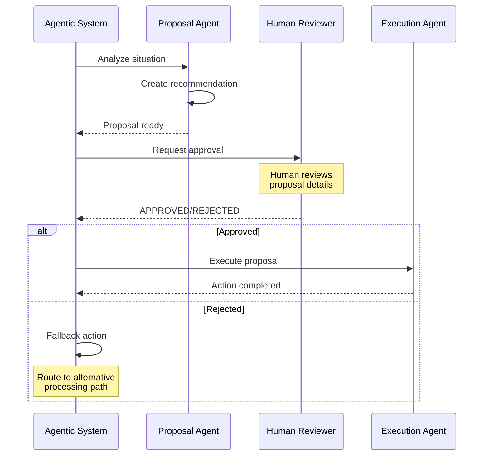
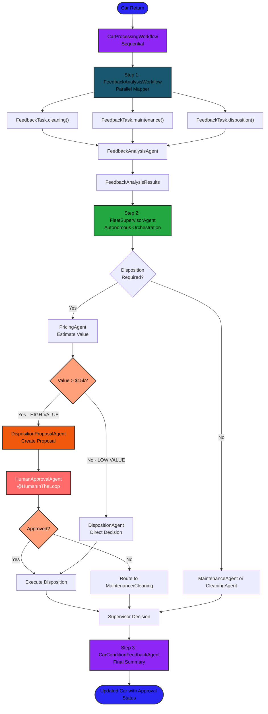
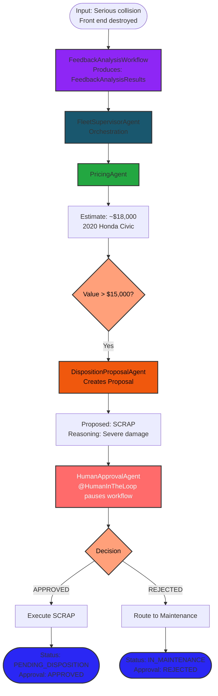
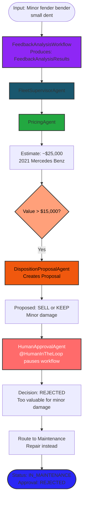
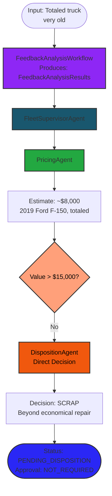

# Step 05 - Human-in-the-Loop Pattern

## Human-in-the-Loop Pattern

In the previous step, you built a **Supervisor Pattern** that orchestrates multiple agents to handle car returns,
including disposition decisions for damaged vehicles.

However, that system made autonomous decisions about vehicle disposition without human oversight. What if you need
**human approval** before executing high-stakes decisions, especially for valuable assets?

In this step, you'll learn about the **Human-in-the-Loop (HITL) pattern** - a critical approach where AI agents pause
execution to request human approval before proceeding with significant actions.

---

## New Requirement from Miles of Smiles Management: Human Approval for High-Value Dispositions

The Miles of Smiles management team has now realized they may have been a bit too eager to give AI full decision powers:
the system has been making autonomous disposition decisions on high-value vehicles without human oversight with some
costly outcomes.

They want to implement a **human approval gate** with these requirements:

1. Any vehicle worth more than **$15,000** requires human approval before disposition
2. Track approval status and reasoning for compliance and audit trail

This ensures that expensive vehicles aren't scrapped or sold without proper human review.

---

## What You'll Learn

In this step, you will:

- Understand the **Human-in-the-Loop (HITL) pattern** and when to use it
- Implement a **two-phase approval workflow** (proposal → review → execution)
- Create a **DispositionProposalAgent** that generates proposals
- Build a **HumanApprovalAgent** using LangChain4j CDI's **`@RegisterHumanInTheLoopAgent`** annotation
- Modify the **FleetSupervisorAgent** to route high-value vehicles through approval
- Add **approval tracking** to the data model
- See how HITL provides **safety and control** in autonomous systems

---

## Understanding Human-in-the-Loop

### What is Human-in-the-Loop?

**Human-in-the-Loop (HITL)** is a pattern where:

- AI agents perform analysis and create recommendations
- Execution **pauses** to request human approval
- Humans review proposals and make final decisions
- System proceeds only after approval


### The Two-Phase Workflow



---


### The Complete HITL Architecture



---

## Implementing the Human-in-the-Loop Pattern

Let's build the HITL system step by step.

### Create the DispositionProposalAgent

This agent creates disposition proposals that will be reviewed by humans.

In `src/main/java/com/carmanagement/agentic/agents`, create `DispositionProposalAgent.java`:

```java title="DispositionProposalAgent.java" hl_lines="25-40 52-62 64"
--8<-- "../../section-2/step-05/src/main/java/com/carmanagement/agentic/agents/DispositionProposalAgent.java"
```

!!! note "Why two disposition agents?"
    You might wonder why we have both `DispositionProposalAgent` and `DispositionAgent`. They serve different purposes:
    `DispositionProposalAgent` creates recommendations for human review on high-value vehicles (>$15K), while
    `DispositionAgent` makes autonomous decisions on lower-value vehicles. 

We also need to create a memory instance for the new agent. Modify the `microprofile-config.properties` file in the
`src/main/resources/META-INF/` directory to declaratively add a memory instance for the `DispositionProposalAgent`:

```properties title="microprofile-config.properties"
--8<-- "../../section-2/step-05/src/main/resources/META-INF/microprofile-config.properties:agent-memory"
```

### Create the HumanApprovalAgent

This agent implements Human-in-the-Loop using LangChain4j CDI's **`@RegisterHumanInTheLoopAgent`** annotation. Instead
of relying on a separate tool, the agent method itself **pauses workflow execution** until a human makes a decision
through the UI.

In `src/main/java/com/carmanagement/agentic/agents`, create `HumanApprovalAgent.java`:

```java title="HumanApprovalAgent.java" hl_lines="7 25"
--8<-- "../../section-2/step-05/src/main/java/com/carmanagement/agentic/agents/HumanApprovalAgent.java"
```

**Key Points:**

- The **`@RegisterHumanInTheLoopAgent`** annotation from LangChain4j marks this agent method as requiring human
  interaction before completing
- It calls `ApprovalService::createProposalAndWaitForDecision()` which returns a `CompletableFuture`
- The Workflow execution **pauses** by calling `approvalFuture.get(5, TimeUnit.MINUTES)` on the future
- A human sees the pending approval in the UI and clicks Approve/Reject
- The future then completes and the workflow resumes with the human's decision
- It returns a message containing APPROVED/REJECTED and the reasoning
- The result is stored in the **AgenticScope** with key `approvalDecision`

### The ApprovalService

The `ApprovalService` manages the `CompletableFuture` instances that pause and resume workflow execution. This is the
bridge between the `HumanApprovalAgent` and the REST endpoints that the UI calls.

In `src/main/java/com/carmanagement/services`, create `ApprovalService.java`:

```java title="ApprovalService.java"
--8<-- "../../section-2/step-05/src/main/java/com/carmanagement/services/ApprovalService.java"
```

**Key Points:**

- `CompletableFuture<ApprovalProposal>` is stored in a map keyed by car number
- The `createProposalAndWaitForDecision()` method creates the future and returns it
- The proposal is persisted in a separate transaction to ensure it's visible to UI queries
- The `processDecision()` method completes the future when human makes a decision
- This completion **resumes the workflow** that was blocked on `.get()`

### Create the ApprovalProposal Entity

This entity stores proposals in the database so the UI can display them.

In `src/main/java/com/carmanagement/models`, create `ApprovalProposal.java`:

```java title="ApprovalProposal.java"
--8<-- "../../section-2/step-05/src/main/java/com/carmanagement/models/ApprovalProposal.java"
```

### Create the ApprovalStatus model

In `src/main/java/com/carmanagement/models`, create `ApprovalStatus.java`:

```java title="ApprovalStatus.java"
--8<-- "../../section-2/step-05/src/main/java/com/carmanagement/models/ApprovalStatus.java"
```

### Create the ApprovalResource

This REST resource allows the UI to fetch pending approvals and submit decisions.

Create `src/main/java/com/carmanagement/resources/ApprovalResource.java` to create the following REST API endpoints:

- `GET /api/approvals/pending` - Returns all pending approval proposals
- `POST /api/approvals/{id}/approve` - Approve a proposal
- `POST /api/approvals/{id}/reject` - Reject a proposal

In `src/main/java/com/carmanagement/resources`, create `ApprovalResource.java`:

```java title="ApprovalResource.java"
--8<-- "../../section-2/step-05/src/main/java/com/carmanagement/resources/ApprovalResource.java"
```


!!!success "How the HITL Flow Works End-to-End"
    1. The `FleetSupervisorAgent` detects a high-value vehicle and invokes the `DispositionProposalAgent`
    2. The proposal is passed to the `HumanApprovalAgent`, which is annotated with `@RegisterHumanInTheLoopAgent`
    3. Inside the agent method, `ApprovalService::createProposalAndWaitForDecision()` persists the proposal to the
       database and returns a `CompletableFuture`
    4. The agent method **blocks** on `approvalFuture.get(5, TimeUnit.MINUTES)` — the workflow pauses here
    5. The UI polls `GET /api/approvals/pending` and displays the proposal to the human reviewer
    6. The human clicks **Approve** or **Reject**, which calls the corresponding REST endpoint
    7. `ApprovalService::processDecision()` completes the `CompletableFuture` with the decision
    8. The agent method **unblocks**, formats the decision, and returns it
    9. The workflow **resumes** with the human's decision

### Update the FleetSupervisorAgent

Now we need to modify the supervisor to implement the new value-based routing with the approval workflow.

Update `src/main/java/com/carmanagement/agentic/agents/FleetSupervisorAgent.java`:

```java title="FleetSupervisorAgent.java" hl_lines="18 68-72 75-91 109"
--8<-- "../../section-2/step-05/src/main/java/com/carmanagement/agentic/agents/FleetSupervisorAgent.java"
```

### Update the CarConditions Model

Finally, we also need to add the approval tracking fields to the data model.

Update `src/main/java/com/carmanagement/model/CarConditions.java`:

```java title="CarConditions.java" hl_lines="8-9 11-16 20-22"
--8<-- "../../section-2/step-05/src/main/java/com/carmanagement/models/CarConditions.java"
```

---

## Try the Complete Solution

Now let's see the Human-in-the-Loop pattern in action!

### Start the database container

!!! important "Podman or Docker"
    The application requires Podman or Docker to run a PostgreSQL database.
    So make sure you have one of them installed and running.

You need to run the database inside Docker or Podman. To start it, run one of the following commands, depending on the
environment that you use:

- Docker:

    ```shell
    docker run -d --name postgres -e POSTGRES_PASSWORD=password -p 5432:5432 pgvector/pgvector:pg17
    ```

- Podman:

    ```shell
    podman run -d --name postgres -e POSTGRES_PASSWORD=password -p 5432:5432 pgvector/pgvector:pg17
    ```

### Start the Application

1. Navigate to the step-05 directory:


=== "Linux / macOS"
    ```bash
    cd section-2/step-05
    ```

=== "Windows"
    ```cmd
    cd section-2\step-05
    ```

2. Start the application:

=== "Linux / macOS"
    ```bash
    ./mvnw liberty:dev
    ```

=== "Windows"
    ```cmd
    mvnw liberty:dev
    ```

3. Open [http://localhost:9080](http://localhost:9080){target="_blank"}

### Test HITL Scenarios

Try these scenarios to see how the approval workflow handles different vehicle values:

#### Scenario 1: High-Value Vehicle Requiring Approval

Enter the following text in the feedback field for the **Honda Civic**:

```text
The car was in a serious collision. Front end is completely destroyed and airbags deployed.
```

**What happens:**



**Expected Result:**

- `PricingAgent` estimates value at ~$18,000 (above threshold)
- `DispositionProposalAgent` creates SCRAP proposal
- `HumanApprovalAgent` pauses the workflow (via `@HumanInTheLoop`) and waits for human input
- Human reviews the proposal in the UI and clicks Approve or Reject
- Workflow resumes with the decision
- Status: `PENDING_DISPOSITION` if approved, `IN_MAINTENANCE` if rejected

#### Scenario 2: High-Value Vehicle - Approval Rejected

Enter the following text in the **Mercedes Benz** feedback field:

```text
Minor fender bender, small dent in rear bumper
```

**What happens:**



**Expected Result:**

- `PricingAgent` estimates value at ~$25,000 (high value)
- `DispositionProposalAgent` suggests SELL or KEEP
- `HumanApprovalAgent` pauses workflow, human REJECTS (too valuable for disposition with minor damage)
- Fallback: Routes to `MaintenanceAgent` instead
- Status: `IN_MAINTENANCE`
- Disposition status: `DISPOSITION_REJECTED` with reasoning

#### Scenario 3: Low-Value Vehicle - No Approval Needed

Enter the following text in the **Ford F-150** feedback field (status: In Maintenance) in the Fleet Status grid:

```text
The truck is totaled, completely inoperable, very old
```

**What happens:**



**Expected Result:**

- `PricingAgent` estimates value at ~$8,000 (below threshold)
- Skips approval workflow entirely (low value)
- `DispositionAgent` makes direct SCRAP decision
- Status: `PENDING_DISPOSITION`
- Disposition status: `DISPOSITION_NOT_REQUIRED`

### Check the Logs

Watch the console output to see the approval workflow execution:

```bash
FeedbackAnalysisWorkflow executing...
  |- FeedbackAnalysisAgent(disposition): DISPOSITION_REQUIRED
FleetSupervisorAgent orchestrating...
  |- PricingAgent: Estimated value $18,000
  |- Value check: $18,000 > $15,000 -> Approval required
  |- DispositionProposalAgent: Proposed SCRAP
  |- HumanApprovalAgent (@HumanInTheLoop): Workflow paused...
  |- Waiting for human decision via UI...
  |- Human decision received: APPROVED
  |- Workflow resumed
CarConditionFeedbackAgent updating...
  |- Disposition status: DISPOSITION_APPROVED
```

Notice how the workflow **pauses** at the `HumanApprovalAgent` and only resumes after the human makes a decision in the
UI.

---

## Recapping the HITL pattern

The HITL pattern provides a safety net for autonomous systems. Human review catches edge cases that AI might miss,
preventing costly mistakes. It also builds trust by allowing a gradual transition from manual to autonomous operations,
while maintaining clear human accountability for critical decisions.

Many industries require human oversight by regulation or policy. Financial services need approval for large
transactions. Healthcare requires physician review of treatment decisions. Legal departments need lawyers to approve
contract terms. Beyond compliance, audit trails that track who approved what and when are essential for accountability.

The real power of HITL is that you can tune the automation level over time:


Start with a low threshold where everything requires approval. As confidence grows, gradually increase the threshold so
only higher-value decisions need human review. Eventually, routine cases can run fully autonomous while high-stakes
decisions still go through HITL.

---


## Experiment Further

1. Try adjusting the approval threshold to see how it affects which vehicles require human review. Lower it to $10,000
   to require approval for more vehicles, raise it to $25,000 to only catch the most expensive ones, or set it to $0 to
   require approval for all dispositions.
2. You could implement multi-level approval where vehicles worth $15,000-$25,000 need a single approver, $25,000-$50,000
   need two approvers, and anything over $50,000 requires manager approval.
3. Add monitoring to track approval rates by value range, average approval time, rejection reasons, and approver
   performance. Implement approval timeouts that auto-reject after 24 hours, escalate to a manager after 48 hours, or
   send reminder notifications. Build an approval history that tracks who approved or rejected each decision, when they
   made it, what reasoning they provided, and what the outcome was.

---

## Troubleshooting

??? warning "All vehicles going through approval workflow"
    Check that the value threshold is correctly configured in `microprofile-config.properties` and that the
    `PricingAgent` is returning numeric values that can be compared.

??? warning "Workflow not pausing for human approval"
    Verify that:

    - The `HumanApprovalAgent` has the `@RegisterHumanInTheLoopAgent` annotation
    - The `ApprovalService` is correctly creating the `CompletableFuture`
    - The agent method is calling `.get()` on the future to block

??? warning "Approval status not being tracked"
    Verify that:

    - `FleetSupervisorAgent` stores disposition status in AgenticScope
    - `CarConditions` model has the `dispositionStatus` and `dispositionReason` fields
    - `CarProcessingWorkflow` retrieves these values from the scope

??? warning "Low-value vehicles still requiring approval"
    Check the value comparison logic in `FleetSupervisorAgent`. Ensure the `PricingAgent` output is being parsed
    correctly as a number.

??? warning "Timeout errors when waiting for approval"
    The `HumanApprovalAgent` has a 5-minute timeout by default. If you need more time, adjust the timeout value in the
    `.get(5, TimeUnit.MINUTES)` call. On timeout, the system defaults to REJECTED for safety.

---

## Agent Observability with MonitoredAgent

Beyond the HITL workflow, step-05 also introduces agent observability. This gives you the ability to inspect what every
agent in the system did, what inputs it received, what it produced, and how long it took.

LangChain4j provides the `MonitoredAgent` interface and an `HtmlReportGenerator` utility in the
`dev.langchain4j.agentic.observability` package. Together, they give you a full execution report of your agentic system
with zero manual instrumentation.

The `MonitoredAgent` interface has a single method that returns an `AgentMonitor`. When your top-level workflow
interface extends `MonitoredAgent`, LangChain4j automatically attaches an `AgentMonitor` listener to the entire agent
tree. This monitor implements `AgentListener` and records every agent invocation across the system.

Before each invocation, it captures the agent name, inputs, and start time. After each invocation, it captures the
output and finish time. On errors, it captures exception details. For nested invocations, it tracks the full call
hierarchy, such as when `FleetSupervisorAgent` calls `PricingAgent` which calls `DispositionProposalAgent`. The monitor
groups executions by memory ID so you can inspect each independent workflow run separately.

Enabling this feature requires two simple steps. First, make your workflow interface extend `MonitoredAgent`. In
`CarProcessingWorkflow.java`, the interface simply extends `MonitoredAgent` with no other changes needed. The framework
handles everything automatically without requiring annotations on individual agents or manual tracking code.

Second, generate an HTML report from the monitor. In `CarManagementService.java`, the `report()` method uses the static
`HtmlReportGenerator.generateReport()` helper to produce a self-contained HTML page. This page includes an agent
topology showing a visual map of all agents and their relationships, an execution timeline with a detailed breakdown of
every agent invocation including inputs, outputs, duration, and nesting level, and error tracking that highlights any
failed invocations with their exception details.

The report is exposed via a REST endpoint in `CarManagementResource.java`. After processing one or more cars, click the
"Generate Report" button in the UI (next to "Refresh Data") to open the report in a new tab. The report shows the full
agent topology of your system, every execution grouped by workflow run, and for each agent invocation, what went in,
what came out, and how long it took. This is invaluable for debugging agent behavior, understanding why the supervisor
made a particular routing decision, or verifying that the HITL workflow paused and resumed correctly.

---
## Cleanup

Before moving to the next step, let's clean up:

1. **Stop the running server** by pressing `Ctrl+C` in the terminal where Liberty is running

2. **Return to the root project directory**:

    ```bash
    cd ..
    ```

---


## What's Next?

You've successfully implemented the Human-in-the-Loop pattern for safe, controlled autonomous decision-making. The
system now routes high-value vehicles through human approval using LangChain4j CDI's `@RegisterHumanInTheLoopAgent`
annotation, creates proposals for human review via the `DispositionProposalAgent`, and pauses workflow execution in the
`HumanApprovalAgent` until a human decides. It tracks approval decisions for audit trails, provides fallback paths for
rejected proposals, and balances automation with human oversight.

In **Step 06**, you'll learn about **multimodal image analysis** — allowing employees to upload car photos during rental
returns, so the system can automatically enrich feedback with visual observations using a multimodal AI agent!

[Continue to Step 06 - Multimodal Image Analysis](step-06.md)
