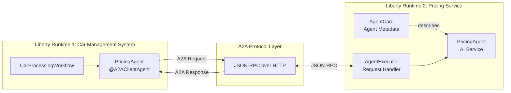
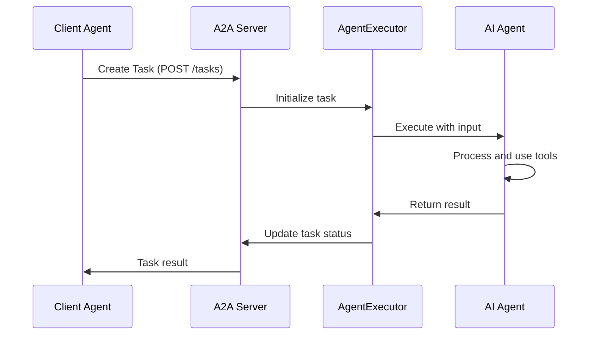
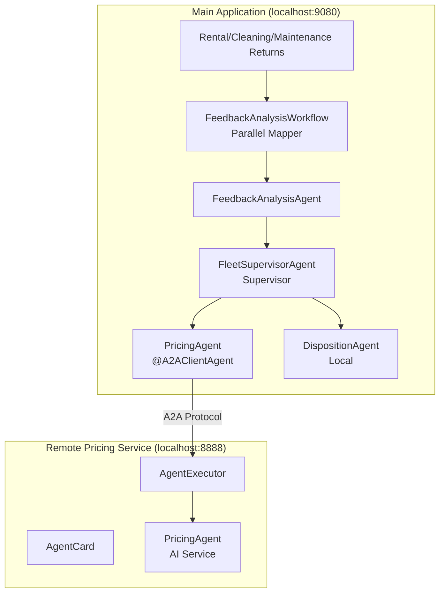
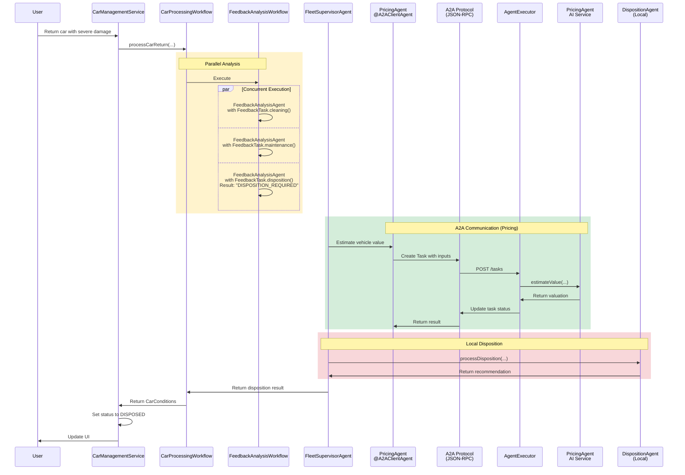

# Step 07 - Using Remote Agents (A2A)

## New Requirement: Distributing the Pricing Service

In the previous steps, you built a complete disposition system with the Supervisor Pattern (Step 4), Human-in-the-Loop
approval (Step 5), and multimodal image analysis that enriches rental feedback with visual observations from car photos
(Step 6). The system works well, but the Miles of Smiles management team has a new architectural requirement:

**The vehicle pricing logic needs to be maintained by a separate team and run as an independent service.**

This is a common real-world scenario where:

1. **Different teams own different capabilities**: The pricing team has specialized expertise in vehicle valuations and
   wants to maintain their own service
2. **The service needs to be reusable**: Multiple client applications (not just car management) might need pricing
   estimates
3. **Independent scaling is required**: The pricing service might need different resources than the main application

You'll learn how to convert the local `PricingAgent` into a remote service using the 
[**Agent-to-Agent (A2A) protocol**](https://a2a-protocol.org/){target="_blank"}.

---

## What You'll Learn

In this step, you will:

- Understand the [**Agent-to-Agent (A2A) protocol**](https://a2a-protocol.org/){target="_blank"} for distributed agent
  communication
- **Convert** the local `PricingAgent` into a remote A2A service
- Build a **client agent** that connects to remote A2A agents using `@RegisterA2AAgent`
- Create an **A2A server** that exposes an AI agent as a remote service
- Learn about **AgentCard** and **AgentExecutor** components from the A2A SDK
- Understand the difference between **Tasks** and **Messages** in A2A protocol
- Run **multiple LangChain4j applications** that communicate via A2A
- See the architectural trade-offs: lose Supervisor Pattern sophistication, gain distribution benefits

!!!note
   
    At the moment the A2A integration is quite low-level and requires some boilerplate code.
    The LangChain4j team is working on higher-level abstractions to simplify A2A usage in future releases.

---

## Understanding the A2A Protocol

The [**Agent-to-Agent (A2A) protocol**](https://a2a-protocol.org/){target="_blank"} is an open protocol for AI agents to
communicate across different systems and platforms.

### Why A2A?

- **Separation of concerns**: Different teams can develop specialized agents independently
- **Scalability**: Distribute agent workload across multiple systems
- **Reusability**: One agent can serve multiple client applications
- **Technology independence**: Agents can be implemented in different languages/frameworks

### A2A Architecture



**The Flow:**

1. **Client agent** (`PricingAgent` with `@RegisterA2AAgent`) sends a request to the remote agent
2. **A2A Protocol Layer** ([JSON-RPC](https://www.jsonrpc.org/){target="_blank"}) transports the request over HTTP
3. **AgentCard** describes the remote agent's capabilities (skills, inputs, outputs)
4. **AgentExecutor** receives the request and orchestrates the execution
5. **Remote AI agent** (`PricingAgent` AI service) processes the request
6. Response flows back through the same path

!!!info "Additional A2A Info"
    For more information about the A2A protocol and the actors involved, see the 
    [A2A documentation](https://a2a-protocol.org/latest/topics/key-concepts/#core-actors-in-a2a-interactions){target="_blank"}. 

---

## Understanding Tasks vs. Messages

The A2A protocol distinguishes between 
[two types of interactions](https://a2a-protocol.org/latest/topics/life-of-a-task/){target="_blank"}:

| Concept | Description | Use Case |
|---------|-------------|----------|
| **Task** | A long-running job with a defined goal and tracked state | "Estimate the market value of this vehicle" |
| **Message** | A single conversational exchange with no tracked state | Chat messages, quick questions |

In this step, we'll use **Tasks** because vehicle pricing is a discrete job with a clear objective.

**Task Lifecycle:**



---

## What Are We Going to Build?

We'll convert Step 5's architecture to use a remote pricing agent:

1. **Keep all HITL features**: `DispositionProposalAgent`, `HumanApprovalAgent`, value-based routing, approval workflow
   — all carried forward from Step 5
2. **Keep DispositionAgent local**: Disposition logic stays in the main application (same as Step 5)
3. **Convert PricingAgent to A2A Client**: Changes from local agent to remote A2A client
4. **Create Remote A2A Server**: A separate LangChain4j application exposing the pricing service

**The Complete Architecture:**



---

## Prerequisites

Before starting:

- **Completed [Step 06](step-06.md){target="_blank"}** - This step directly builds on Step 6's architecture
- Application from Step 06 is stopped (Ctrl+C)
- Ports 8080 and 8888 are available (you'll run two applications simultaneously)
- Understanding of Step 6's multimodal image analysis, Step 5's HITL Pattern, and Step 4's Supervisor Pattern (we keep
  the same patterns, just make PricingAgent remote)

Before starting:

- You have stopped (Ctrl+C) any running Liberty instances
- You are in the root project directory (not a `step-XX` subdirectory)

---

## Understanding the Project Structure

The Step 07 code includes **two separate applications**:

```
section-2/step-07/
├── multi-agent-system/          # Main car management application (port 9080)
│   ├── src/main/java/com/carmanagement/
│   │   ├── agentic/
│   │   │   ├── agents/
│   │   │   │   ├── PricingAgent.java              # A2A client agent
│   │   │   │   ├── DispositionAgent.java          # Local agent
│   │   │   │   ├── DispositionProposalAgent.java  # Creates proposals
│   │   │   │   ├── HumanApprovalAgent.java        # @HumanInTheLoop
│   │   │   │   └── FeedbackAnalysisAgent.java     # Parameterized feedback analyzer
│   │   │   └── workflows/
│   │   │       ├── FeedbackAnalysisWorkflow.java  # Parallel mapper analysis
│   │   │       └── CarProcessingWorkflow.java     # Main orchestrator
│   │   ├── models/
│   │   │   └── ApprovalProposal.java              # Approval entity
│   │   ├── resources/
│   │   │   └── ApprovalResource.java              # Approval REST endpoints
│   │   └── services/
│   │       └── ApprovalService.java               # Manages HITL workflow 
│   └── pom.xml
│
└── remote-a2a-agent/            # Remote pricing service (port 8888)
    ├── src/main/java/com/carmanagement/
    │   └── agentic/
    │       ├── agents/
    │       │   └── PricingAgent.java              # AI service for vehicle pricing
    │       ├── cards/
    │       │   └── PricingAgentCard.java          # Describes agent capabilities
    │       └── executors/
    │           └── PricingAgentExecutor.java      # Handles A2A requests
    └── pom.xml
```

**Why Two Applications?**

- Simulates a real-world scenario where different teams maintain different agents
- The pricing service could be reused by multiple client applications
- Demonstrates cross-application agent communication via A2A

---

!!! warning "Warning: this chapter involves many steps"
    In order to build out the solution, you will need to go through quite a few steps. While it is entirely possible to
    make the code changes manually (or via copy/paste), we recommend starting fresh from Step 07 with the changes
    already applied. You will then be able to walk through this chapter and focus on the examples and suggested
    experiments at the end of this chapter.

=== "Option 1: Continue from Step 06"

    If you want to continue building on top of Step-06 code, you'll need to restructure the directory and copy updated
    files:
    
    === "Linux / macOS"
        ```bash
        cd section-2/step-06
        mkdir -p multi-agent-system
        mv mvnw mvnw.cmd pom.xml src multi-agent-system/
        cp ../step-07/multi-agent-system/pom.xml ./multi-agent-system/pom.xml
        mkdir -p remote-a2a-agent/src/main/java/com/carmanagement
        mkdir -p remote-a2a-agent/src/main/liberty/config
        mkdir -p remote-a2a-agent/src/main/resources/META-INF
        cp ../step-07/remote-a2a-agent/mvnw ./remote-a2a-agent/
        cp ../step-07/remote-a2a-agent/mvnw.cmd ./remote-a2a-agent/
        cp ../step-07/remote-a2a-agent/pom.xml ./remote-a2a-agent/
        cp ../step-07/remote-a2a-agent/src/main/liberty/config/server.xml ./remote-a2a-agent/src/main/liberty/config/
        cp ../step-07/remote-a2a-agent/src/main/resources/META-INF/microprofile-config.properties ./remote-a2a-agent/src/main/resources/META-INF/
        ```
    
    === "Windows"
        ```cmd
        cd section-2\step-06
        mkdir multi-agent-system
        move mvnw multi-agent-system\
        move mvnw.cmd multi-agent-system\
        move pom.xml multi-agent-system\
        move src multi-agent-system\
        copy ..\step-07\multi-agent-system\pom.xml .\multi-agent-system\pom.xml
        mkdir remote-a2a-agent\src\main\java\com\carmanagement
        mkdir remote-a2a-agent\src\main\liberty\config
        mkdir remote-a2a-agent\src\main\resources\META-INF
        copy ..\step-07\remote-a2a-agent\mvnw .\remote-a2a-agent\
        copy ..\step-07\remote-a2a-agent\mvnw.cmd .\remote-a2a-agent\
        copy ..\step-07\remote-a2a-agent\pom.xml .\remote-a2a-agent\
        copy ..\step-07\remote-a2a-agent\src\main\liberty\config\server.xml .\remote-a2a-agent\src\main\liberty\config\
        copy ..\step-07\remote-a2a-agent\src\main\resources\META-INF\microprofile-config.properties .\remote-a2a-agent\src\main\resources\META-INF\
        ```
    
    **Note:** The `remote-a2a-agent` directory now contains the necessary infrastructure (`pom.xml`, `mvnw`,
    `server.xml`, and `microprofile-config.properties`). The `src/main/java/com/carmanagement` directory is empty and
    ready for you to create the A2A agent files in Part 2. You'll update `PricingAgent.java` in the `multi-agent-system`
    in Part 1 below.

=== "Option 2: Follow along using the completed solution [Recommended]"

    If you prefer to follow along (without making any code changes), navigate to the completed
    `section-2/step-07/remote-a2a-agent` directory:
    
    === "Linux / macOS"
        ```bash
        cd section-2/step-07/multi-agent-system
        ```
    
    === "Windows"
        ```cmd
        cd section-2\step-07\multi-agent-system
        ```

---

## Part 1: Convert PricingAgent to A2A Client

The only change needed in the main application is converting the `PricingAgent` from a local agent to an A2A client.

### Step 1: Update the PricingAgent to A2A Client

**This is the key change from Step 5!** The `PricingAgent` was a local agent with detailed pricing guidelines,
depreciation tables, and an `@Output` post-processor. Now it becomes a simple client that delegates to the remote
service.

**Step 5 Version (Local):**

- Had detailed `@SystemMessage` with pricing guidelines and depreciation tables
- Had `@Output` method to normalize value format
- Made decisions locally using AI

**Step 7 Version (A2A Client):**

- Uses `@RegisterA2AAgent` to connect to remote service
- Delegates all pricing logic to the remote service
- No `@Output` method needed — the remote service handles formatting

Update `multi-agent-system/src/main/java/com/carmanagement/agentic/agents/PricingAgent.java`:

```java title="PricingAgent.java"
--8<-- "../../section-2/step-07/multi-agent-system/src/main/java/com/carmanagement/agentic/agents/PricingAgent.java"
```

**Let's break it down:**

#### `@RegisterA2AAgent` Annotation

```java
@RegisterA2AAgent(
    name = "pricing-agent",
    description = "Pricing specialist that estimates vehicle market value based on make, model, year, and condition.",
    a2aServerUrl = "http://localhost:8888",
    outputKey = "carValue"
)
```

This annotation transforms the method into an **A2A client**:

- **`a2aServerUrl`**: The URL of the remote A2A server

#### The Method Signature

```java
String estimateValue(
    String carMake,
    String carModel,
    Integer carYear,
    String carCondition,
    String feedback
);
```

These parameters are sent to the remote agent as task inputs. The parameters match exactly what the remote
`PricingAgent` expects (same as Step 5's local version).

#### How It Works

1. When this method is called, LangChain4j/LangChain4j CDI:
    1. Creates an A2A Task with the method parameters as inputs
    2. Sends the task to the remote server via JSON-RPC
    3. Waits for the remote agent to complete the task
    4. Returns the result as a String

2. No manual HTTP requests needed
3. Type-safe: compile-time checking of parameters
4. Automatic error handling and retries

---

## Part 2: Build the Remote A2A Server

Now let's build the remote pricing service that will handle A2A requests from the main application.

Navigate to the `remote-a2a-agent` directory:

```bash
cd remote-a2a-agent
```

### Step 2: Create the PricingAgent (AI Service)

The AI agent that estimates vehicle market values — the same logic that was local in Step 5.

In `src/main/java/com/carmanagement`, create `PricingAgent.java`:

```java title="PricingAgent.java"
--8<-- "../../section-2/step-07/remote-a2a-agent/src/main/java/com/carmanagement/PricingAgent.java"
```

**Key Points:**

- **`@RegisterAIService`**: Registers this as an AI service
- **System message**: Identical to step-05's local `PricingAgent` — same pricing guidelines and depreciation tables
- **Parameters**: `carMake`, `carModel`, `carYear`, `carCondition`, `feedback` — exactly matching the client's method
  signature
- **No tools needed**: Pricing is purely LLM-based, no tool invocation

!!!note "AI Service vs. Agentic Agent"
    Notice this is a **traditional AI service** (from Section 1), not an agentic workflow. 
    The A2A server can expose both types.

### Step 3: Create the AgentCard

The **AgentCard** describes the agent's capabilities, skills, and interface.

In `src/main/java/com/carmanagement`, create `PricingAgentCard.java`:

```java title="PricingAgentCard.java"
--8<-- "../../section-2/step-07/remote-a2a-agent/src/main/java/com/carmanagement/PricingAgentCard.java"
```

**Let's break it down:**

#### `@PublicAgentCard` Annotation

```java
@Produces
@PublicAgentCard
public AgentCard agentCard() {
    ...
}
```

This makes the `AgentCard` available at the `/.well-known/agent-card.json` endpoint. Clients can query this endpoint to
discover the agent's capabilities.

#### AgentCard Components

**Basic Information:**
```java
.name("Pricing Agent")
.description("Estimates the market value of a vehicle based on make, model, year, and condition.")
.version("1.0.0")
```

**Capabilities:**
```java
.capabilities(AgentCapabilities.builder()
    .streaming(true)
    .pushNotifications(false)
    .build()
)
```

**Skills:**
```java
.skills(List.of(
    AgentSkill.builder()
        .id("pricing")
        .name("Vehicle pricing")
        .description("Estimates the market value of a vehicle based on make, model, year, and condition")
        .tags(List.of("pricing", "valuation"))
        .build()
))
```

Skills describe what the agent can do. This helps clients discover appropriate agents for their needs.

**Transport Protocol:**
```java
.preferredTransport(TransportProtocol.JSONRPC.asString())
.supportedInterfaces(List.of(
    new AgentInterface(TransportProtocol.JSONRPC.asString(), "http://localhost:8888")
))
```

Specifies that this agent communicates via JSON-RPC over HTTP and the endpoint URL for the agent.

### Step 4: Create the AgentExecutor

The **AgentExecutor** handles incoming A2A requests and orchestrates the AI agent.

In `src/main/java/com/carmanagement`, create `PricingAgentExecutor.java`:

```java title="PricingAgentExecutor.java"
--8<-- "../../section-2/step-07/remote-a2a-agent/src/main/java/com/carmanagement/PricingAgentExecutor.java"
```

**Let's break it down:**

#### CDI Bean with AgentExecutor Factory

```java
@ApplicationScoped
public class PricingAgentExecutor {
    ...

    @Produces
    public AgentExecutor agentExecutor(PricingAgent pricingAgent) {
        ...
    }
}
```

Produces an `AgentExecutor` bean that LangChain4j will use to handle A2A task requests.

#### Task Processing

The executor extracts the input parameters from the incoming message and calls the PricingAgent:

```java
String agentResponse = pricingAgent.estimateValue(
    inputs.get(0),                      // carMake
    inputs.get(1),                      // carModel
    Integer.parseInt(inputs.get(2)),    // carYear
    inputs.get(3),                      // carCondition
    inputs.get(4)                       // feedback
);
```

Extracts each parameter by index from the message parts. The order matches the client's method signature exactly.

#### Return the Result

```java
TextPart responsePart = new TextPart(agentResponse, null);
List<Part<?>> parts = List.of(responsePart);
agentEmitter.addArtifact(parts);
agentEmitter.complete();
```

Creates a text part with the agent's response and sends it back to the client via the `AgentEmitter`. This completes the
A2A task.

---

## Try It Out

You'll need to run **two applications simultaneously**.

### Terminal 1: Start the Remote A2A Server

=== "Linux / macOS"
    ```bash
    cd remote-a2a-agent
    ./mvnw liberty:dev
    ```

=== "Windows"
    ```cmd
    cd remote-a2a-agent
    mvnw liberty:dev
    ```

Wait for:

```bash
[INFO] ************************************************************************
[INFO] *    Liberty is running in dev mode.
[INFO] *        Automatic generation of features: [ Off ]
[INFO] *        h - see the help menu for available actions, type 'h' and press Enter.
[INFO] *        q - stop the server and quit dev mode, press Ctrl-C or type 'q' and press Enter.
[INFO] *    Liberty server port information:
[INFO] *        Liberty server HTTP port: [ 8888 ]
[INFO] *        Liberty server HTTPS port: [ 9443 ]
[INFO] *        Liberty debug port: [ 7777 ]
[INFO] ************************************************************************
```

The remote service is now running and ready to accept A2A requests for pricing!

### Start the database container

!!! important "Podman or Docker"
    The application requires Podman or Docker to run a PostgreSQL database.
    So make sure you have one of them installed and running.

You need to run the database inside Docker or Podman. To start it, Open a **new terminal** and run one of the following
commands, depending on the environment that you use:

- Docker:

    ```shell
    docker run -d --name postgres -e POSTGRES_PASSWORD=password -p 5432:5432 pgvector/pgvector:pg17
    ```

- Podman:

    ```shell
    podman run -d --name postgres -e POSTGRES_PASSWORD=password -p 5432:5432 pgvector/pgvector:pg17
    ```

### Terminal 2: Start the Main Application

=== "Linux / macOS"
    ```bash
    cd multi-agent-system
    ./mvnw liberty:dev
    ```

=== "Windows"
    ```cmd
    cd multi-agent-system
    mvnw liberty:dev
    ```

Wait for:
```bash
[INFO] ************************************************************************
[INFO] *    Liberty is running in dev mode.
[INFO] *        Automatic generation of features: [ Off ]
[INFO] *        h - see the help menu for available actions, type 'h' and press Enter.
[INFO] *        q - stop the server and quit dev mode, press Ctrl-C or type 'q' and press Enter.
[INFO] *    Liberty server port information:
[INFO] *        Liberty server HTTP port: [ 9080 ]
[INFO] *        Liberty debug port: [ 58576 ]
[INFO] ************************************************************************
```

### Test the Complete Flow

Open your browser to [http://localhost:9080](http://localhost:9080){target=_blank}.

You'll see the **Fleet Status** grid with inline feedback forms in the **Action** column and the approval notification
button.

{: .center}

Find the Honda Civic (status: Rented) in the Fleet Status grid and enter feedback indicating severe damage:

```
looks like this car hit a tree and is damaged beyond repair
```

Click **Return**.

**What happens?**

1. **Parallel Analysis** (`FeedbackAnalysisWorkflow`):
    1. `FeedbackTask::disposition()` executed by `FeedbackAnalysisAgent`: "Disposition required — severe damage"
    2. `FeedbackTask::maintenance()` executed by `FeedbackAnalysisAgent`: "Major repairs needed"
    3. `FeedbackTask::cleaning()` executed by `FeedbackAnalysisAgent`: "Not applicable"

2. **Supervisor Orchestration** (FleetSupervisorAgent):
    1. Analyzes feedback and determines disposition is required
    2. Invokes PricingAgent (remote via A2A) to estimate vehicle value
    3. Invokes DispositionAgent (local) to determine disposition

3. **A2A Communication** (for pricing):
    1. Client sends task to `http://localhost:8888`
    2. `AgentExecutor` receives and processes task
    3. `PricingAgent` (AI service) estimates the vehicle value
    4. Result flows back to client

4. **Local Disposition**:
    1. `DispositionAgent` determines action based on value and condition

5. **UI Update**:
    1. Car status → `DISPOSED`
    2. Car status updates to `PENDING_DISPOSITION` in the Fleet Status grid

### Check the Logs

**Terminal 1 (Remote A2A Server):**
```shell
Remote A2A PricingAgent called
```

**Terminal 2 (Main Application):**
```shell
[INFO] ... CarManagementResource -- Processing rental return for car 3 with feedback: looks like this car hit a tree and is damaged beyond repair
[INFO] ... CarManagementResource -- No image provided
[INFO] ... AgentExecutor -- Skipping optional agent 'car-image-analysis-agent' because of missing argument 'carImage'
[INFO] ... SupervisorPlanner -- Agent Invocation: AgentInvocation{agentName='pricing-agent$0', arguments={carMake=Audi, carModel=Q4, carYear=2025, carCondition=Brake pads recently replaced, feedback=looks like this car hit a tree and is damaged beyond repair}}
[INFO] ... DefaultA2AClientBuilder -- Response: Estimated Value: $42,240  
[INFO] Justification: The 2025 Audi Q4 is a luxury model with an estimated new‑car base value of about $60,000. At 1 year old it has suffered a 12 % depreciation, reducing it to $52,800. The feedback indicates severe, tree‑impact damage, which we treat as “poor” condition and apply a further 20 % reduction, resulting in an estimated market value of roughly $42,240.
[INFO] ... SupervisorPlanner -- Agent Invocation: AgentInvocation{agentName='disposition-proposal-agent$1', arguments={carMake=Audi, carModel=Q4, carYear=2025, carNumber=3, carCondition=Brake pads recently replaced, carValue=$42,240, feedback=looks like this car hit a tree and is damaged beyond repair}}
[INFO] ... SupervisorPlanner -- Agent Invocation: AgentInvocation{agentName='human-approval-agent$2', arguments={}}
[INFO] ... HumanApprovalAgent -- 🛑 HITL Tool: Creating approval proposal for car 3 - 2025 Audi Q4
[INFO] ... HumanApprovalAgent -- ⏸️  WORKFLOW PAUSED - Waiting for human approval decision via UI
[INFO] ... ApprovalProposalManager -- No approval proposal found for car number 3
[INFO] ... ApprovalService -- Created approval proposal ID=151 for car 3 - 2025 Audi Q4 (Value: $42,240, Proposed: SCRAP)
[INFO] ... ApprovalService -- ⏸️  WORKFLOW PAUSED - Waiting for human approval decision
[INFO] ... ApprovalService -- Proposal persisted with ID: 151, status: PENDING
[INFO] ... ApprovalService -- ✅ Proposal creation transaction committed - now visible to queries
[INFO] ... ApprovalResource -- Decision 'DISPOSE_CAR' received for proposal 151 by Workshop User
[INFO] ... ApprovalProposalManager -- Updating approval proposal: com.carmanagement.models.ApprovalProposal@233d2152
[INFO] ... ApprovalService -- Human decision received for car 3: APPROVED - DISPOSE_CAR: Dispose decision by human reviewer
[INFO] ... ApprovalService -- ▶️  WORKFLOW RESUMED - Continuing with approval decision
[INFO] ... HumanApprovalAgent -- ▶️  WORKFLOW RESUMED - Human decision received: APPROVED
[INFO] ... HumanApprovalAgent -- Response: Human Decision: APPROVED
[INFO] Reason: DISPOSE_CAR: Dispose decision by human reviewer
[INFO] Approved By: Workshop User
[INFO] Decision Time: 2026-06-23T11:42:39.411116
[INFO] ... SupervisorPlanner -- Agent Invocation: AgentInvocation{agentName='done', arguments={response=DISPOSE_CAR}}
[INFO] ... CarProcessingWorkflow -- DEBUG CarConditions output method:
[INFO] ... CarProcessingWorkflow --   generalCondition: Dispose the vehicle because a tree collision caused extensive damage beyond repair.
[INFO] ... CarProcessingWorkflow --   carAssignment: DISPOSITION
[INFO] ... CarProcessingWorkflow --   dispositionStatus: null
[INFO] ... CarProcessingWorkflow --   dispositionReason: null
[INFO] ... CarManagementService -- CarConditionFeedbackAgent updating...
[INFO] ... CarManagementService -- Car marked for disposition - awaiting final decision
[INFO] ... CarInfoManager -- Updating car info: CarInfo {  id=3,
[INFO]   make=Audi,
[INFO]   model=Q4,
[INFO]   year=2025,
[INFO]   condition=Dispose the vehicle because a tree collision caused extensive damage beyond repair.,
[INFO]   status=pending disposition
[INFO] }
```

Notice the **cross-application communication** via A2A!
```shell
[INFO] ... SupervisorPlanner -- Agent Invocation: AgentInvocation{agentName='pricing-agent$0', arguments={carMake=Audi, carModel=Q4, carYear=2025, carCondition=Brake pads recently replaced, feedback=looks like this car hit a tree and is damaged beyond repair}}
[INFO] ... DefaultA2AClientBuilder -- Response: Estimated Value: $42,240  
[INFO] Justification: The 2025 Audi Q4 is a luxury model with an estimated new‑car base value of about $60,000. At 1 year old it has suffered a 12 % depreciation, reducing it to $52,800. The feedback indicates severe, tree‑impact damage, which we treat as “poor” condition and apply a further 20 % reduction, resulting in an estimated market value of roughly $42,240.
```

---

## How It All Works Together

Let's trace the complete flow:



---

## Understanding the A2A Implementation

### Client Side (`@A2AClientAgent`)

The A2A client agent is remarkably simple:

```java
@RegisterA2AAgent(a2aServerUrl = "http://localhost:8888", ...)
String estimateValue(...)      // PricingAgent
```

LangChain4j/LangChain4j CDI handles:

- Creating the A2A task
- Serializing method parameters as task inputs
- Sending the HTTP request via JSON-RPC
- Waiting for the response
- Deserializing the result
- Error handling and retries

### Server Side (AgentCard + AgentExecutor)

The server requires more components:

| Component | Purpose |
|-----------|---------|
| **AgentCard** | Describes agent capabilities, published at `/.well-known/agent-card.json` endpoint |
| **AgentExecutor** | Receives and processes A2A task requests |
| **AgentEmitter** | Manages task lifecycle and sends results back to client |
| **AI Agent** | The actual AI service (PricingAgent) |

This separation allows:
- Agents to focus on business logic
- A2A infrastructure to handle protocol details
- **Remote agents to be reused** — any application can connect to the pricing service via A2A

---

## Key Takeaways

- **A2A enables distributed agents**: Different teams can maintain specialized agents in separate systems
- **`@RegisterA2AAgent` is powerful**: Simple annotation transforms a method into an A2A client
- **AgentCard describes capabilities**: Clients can discover what remote agents can do
- **AgentExecutor handles protocol**: Separates A2A infrastructure from agent logic
- **Tasks vs. Messages**: A2A supports both task-based and conversational interactions
- **Type-safe integration**: Method parameters automatically become task inputs
- **Remote agents integrate seamlessly**: Works with existing workflows and local agents
- **Two runtimes communicate**: Real-world simulation of distributed agent systems
- **Selective distribution**: Not every agent needs to be remote — only distribute what benefits from it (e.g., the
  pricing service can be reused by other applications)
- **Local + remote mix**: Combining local agents (`DispositionAgent`) with remote A2A agents (`PricingAgent`) in the
  same workflow

---

## Experiment Further

### 1. Add Agent Discovery

The `AgentCard` is published at `http://localhost:8888/.well-known/agent-card.json`. Try:

```bash
curl http://localhost:8888/.well-known/agent-card.json | jq
```

You'll see the full agent description including the pricing skill, capabilities, and transport protocols.

### 2. Test Different Disposition Scenarios

Try these feedback examples:

**Scenario 1: Sell the car**
```
Minor engine issues, good body condition, low mileage. Repair cost: $800.
```

**Scenario 2: Donate the car**
```
Old car, high mileage, runs but needs work. Market value low.
```

**Scenario 3: Scrap the car**
```
Total loss from flood damage, electrical system destroyed.
```

Observe how the remote agent makes different decisions!

### 3. Create Your Own A2A Agent

What other specialized agents could be useful?

- **Route Planner Agent**: Plans maintenance schedules for the fleet
- **Insurance Agent**: Assesses insurance claims for damaged cars
- **Inventory Agent**: Tracks fleet availability across locations

Try creating a simple A2A server for one of these!

---

## Troubleshooting

??? warning "Connection refused to localhost:8888"
    Make sure the remote A2A server is running in Terminal 1. Check for:
    ```
    Listening on: http://localhost:8888
    ```

    If you see "Port already in use", another application is using port 8888. You can change it in
    `remote-a2a-agent/src/main/liberty/config/server.xml`:
    ```xml
    <httpEndpoint
        id="defaultHttpEndpoint"
        httpPort="8889"
        host="*"
    />
    ```

    Then update the client's `a2aServerUrl` accordingly.

??? warning "Task execution timeout"
    If the remote agent takes too long to respond, you might see a timeout error. The default timeout is sufficient for
    most cases, but you can increase it if needed by configuring the A2A client.

??? warning "Parameter mismatch errors"
    If you see errors about missing parameters, verify that:

    - Client agent method parameter names match what `AgentExecutor` extracts
    - The text parts are extracted in the correct order in the `AgentExecutor`
    - All required parameters are being sent by the client

??? warning "Both applications on same port"
    If you see "Port already in use" on 8080:

    - Make sure you stopped the application from Step 06
    - Only run the main application from `multi-agent-system`, not from a previous step directory
    - Check for zombie Java processes: `ps aux | grep java`

---
## Cleanup

Before moving to the conclusion, let's clean up:

1. **Stop both running servers**:
    - In Terminal 1 (remote-a2a-agent): Press `Ctrl+C`
    - In Terminal 2 (multi-agent-system): Press `Ctrl+C`

---


## What's Next?

You've successfully distributed the pricing service as a remote A2A agent while keeping the rest of the system local!

You learned how to:

- Convert local agents to remote A2A services
- Connect to remote agents using `@RegisterA2AAgent`
- Build A2A servers with `AgentCard` and `AgentExecutor`
- Integrate remote agents into complex workflows
- Run multiple LangChain4j applications that communicate via A2A
- Understand the architectural trade-offs between local and distributed agents

**Key Progression:**
- **Step 4**: Sophisticated local orchestration with Supervisor Pattern
- **Step 5**: Human-in-the-Loop for safe, controlled autonomous decisions
- **Step 6**: Multimodal image analysis for enriched feedback
- **Step 7**: Distributed architecture with A2A protocol

Congratulations on completing the final step of Section 2! Ready to wrap up? Head to the conclusion to review everything
you've learned and see how these patterns apply to real-world scenarios!

[Continue to Conclusion - Mastering Agentic Systems](conclusion.md)

---

## Additional Resources

- [A2A Protocol Specification](https://a2a.dev)
- [LangChain4j Documentation](https://docs.langchain4j.dev/intro/)
- [LangChain4j Agents and Agentic AI Documentation](https://docs.langchain4j.dev/tutorials/agents)
